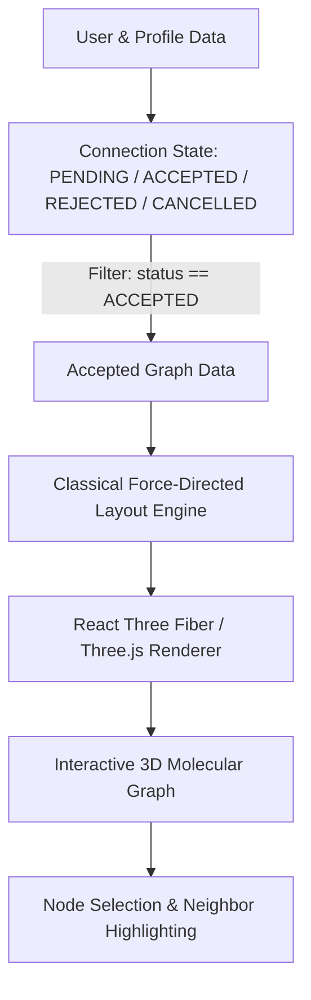

# MOLECULE — MVP Source of Truth

**Tagline:** See your social world in 3D.

## 1. Core aim

Molecule is an MVP for an interactive molecular-inspired 3D social graph.

- Person/user → 3D node / atom-like sphere
- Mutual connection → bond / rod
- Connected group → molecular-like structure
- Social network → interactive 3D structure

This is a visual/modeling metaphor. It does not claim that people literally behave like atoms or that social relationships follow chemical laws.

## 2. MVP goal

Prove this flow:

Landing Page → Sign Up / Sign In → Profile → Find People → Connect → Mutual Connection → 3D Social Network

## 3. Build now

### Landing page

- White/silky, airy, minimal design
- Large whitespace
- Crystallized/translucent molecular visual
- Scroll-driven animation
- Clear Get Started and Sign In actions
- Explain: people become nodes, connections become bonds, networks become structures

### Authentication

- Sign up
- Sign in
- Sign out
- Email/password and/or Google, depending on the selected backend

### Profile

- Name
- Username
- Avatar
- Bio
- Optional public social links
- Connection count

### People

- Search users
- Open profile
- Send connection request
- Accept/reject request

### Connections

Suggested states:
PENDING, ACCEPTED, REJECTED, CANCELLED

Only ACCEPTED/mutual connections become graph bonds.

### 3D network

- User = node
- Mutual connection = bond
- Rotate, zoom, pan
- Select a node
- Highlight connected nodes
- Show basic profile information

### Layout

Use a classical graph-layout / force-directed / custom geometric method for the MVP. The layout only needs to be clear and usable; it does not need to be optimal.

## 4. Do NOT build in MVP

- Qiskit
- QAOA
- QUBO
- Quantum hardware
- Quantum simulator dependencies
- Large-scale million-user infrastructure
- Social-media scraping
- Private social-account access
- Complex AI training pipelines

## 5. Future research

After professor acceptance:

MVP → layout optimization problem → AI candidate structures → QUBO → QAOA / quantum-inspired optimization → Qiskit experiments → classical vs quantum/hybrid comparison

IBM Qiskit is a future technical reference, not an MVP dependency:
[IBM Qiskit Documentation](https://www.ibm.com/quantum/qiskit#about)

## 6. Related research

A key foundation is:

Marcin Budka, Krzysztof Juszczyszyn, Katarzyna Musial, Anna Musial. “Molecular model of dynamic social network based on e-mail communication.” Social Network Analysis and Mining (2013). DOI: 10.1007/s13278-013-0101-4.

This supports the molecular/physical modeling foundation. Our proposed MVP focuses on an interactive product workflow, mutual connections, 3D visualization, and a future AI/quantum extension.

## 7. Landing-page motion concept

1. One crystal sphere appears — “People become nodes.”
2. A second sphere appears and a bond forms — “Connections become bonds.”
3. More nodes form — “Together, they become a structure.”
4. The structure morphs into alternative layouts — future AI concept.
5. The network grows — scalability story.
6. Final calm molecule — “Build your network.”

Keep motion slow, restrained and premium.

## 8. Suggested pages

- `/` Landing
- `/auth` Authentication
- `/dashboard`
- `/profile`
- `/people`
- `/network`
- `/settings`

## 9. Suggested data model

### User

id, name, username, email, avatar_url, bio, created_at

### SocialProfile

id, user_id, platform, profile_url, display_username

### Connection

id, requester_id, receiver_id, status, created_at, updated_at

Optional:

### NetworkLayout

id, user_id, version, layout_data, created_at

## 10. Suggested architecture

Frontend:

- React / Next.js
- TypeScript
- Tailwind CSS
- Three.js / React Three Fiber
- GSAP or equivalent for scroll motion

Backend:

- Supabase or another simple authentication/database service

Flow:

Frontend → Backend/Database → Users / Profiles / Connections → 3D Renderer

## 11. Privacy

- Do not scrape private social accounts.
- Do not access external accounts without explicit authorization.
- Initially store public profile links entered by users.
- Add visibility controls.
- Allow account deletion.
- Clearly explain stored data.

## 12. MVP milestones

1. Project setup + landing page
2. Authentication
3. Profile
4. People discovery
5. Connection requests
6. Graph construction
7. 3D visualization
8. Landing-page scroll animation
9. Testing + professor demo

## 13. Professor Demo Walkthrough Script

Follow this 5-minute evaluation walkthrough from a clean state:

1. **Landing Experience (`/`)**:
   - Observe the full-screen hero: *"See your social world in 3D."*
   - Interact with the live crystal molecule in the hero canvas via pointer movement.
   - Scroll or click through the **6-stage storytelling** (*Individuals → Relationship → Emergence → Structure Exploration → Expansion → The Molecular World*).
   - Click **"Build your network"** to proceed to Authentication.

2. **Authentication & Identity (`/auth`)**:
   - Test 1-click demo selection: Click **Alex Vance** (or Maya Chen).
   - Alternatively, test form validation (invalid email format, password < 6 chars, username constraints).
   - Successful auth lands on `/dashboard`.

3. **Profile & Privacy (`/profile`)**:
   - Inspect profile metadata and verified mutual bonds count.
   - Click **"Edit Profile"** to update display name, avatar URL, or bio.
   - Test **Public Social Links**: Add a validated GitHub or LinkedIn link with required `https://` prefix.
   - Test **Privacy & Visibility Controls**: Toggle Profile, Email, or Social Links between *Public* and *Bonds Only*. State persists immediately.

4. **People Discovery & Profile Preview (`/people`)**:
   - Filter peers by search term (e.g. "Chen", "architect", "spatial").
   - Click any user card or **"Preview"** to open the **Profile Preview Modal** showing their bio, bonds, and linked social profiles.
   - Notice the connection button state: *Connect*, *Request Sent*, or *Connected*.

5. **Mutual Connection & Bond Formation Workflow**:
   - Log in as **Alex Vance**.
   - Send a connection request to an unconnected peer (or observe a pending request from someone else).
   - Use the **Global Demo Switcher** in the top navigation bar to switch to that peer in one click!
   - In `/network`, go to **Pending Requests** and click **Accept**.
   - The status updates immediately to **ACCEPTED**.

6. **3D Molecular Graph & Node Inspection (`/3d-lab` & `/dashboard`)**:
   - Open `/3d-lab`. Notice the new mutual connection is rendered as a physical crystal bond!
   - Rotate (left-click drag), pan (right-click drag), and zoom (scroll wheel).
   - Click any node to open the **Node Inspection Drawer**: highlights the selected node, dims distant nodes, and highlights immediate connected neighbors.
   - Click on neighbor chips to smoothly pivot focus between friends.
   - Open **Layout Controls** in 3D Lab: adjust *Repulsion*, *Spring Length*, and *Relaxation Passes*, then click **"Recalculate"** to watch the classical force-directed layout relax in real time.
   - Click **Reset Camera** to restore the default framing.

7. **Privacy & Data Reset (`/settings`)**:
   - Review the privacy consent guarantees.
   - Click **"Reset Local Mock Data"** to cleanly wipe localStorage and return to baseline demo fixtures.

8. **Future Research Boundary**:
   - The MVP is strictly classical.
   - Future extensions post-professor acceptance: AI candidate 3D layouts, QUBO formulation, QAOA quantum circuit experiments via IBM Qiskit, and classical vs. quantum benchmark comparisons.

## 14. Architecture & Data Flow

## 15. Complete MVP Definition of Done

- [x] Visitor understands the Molecule concept from the landing page.
- [x] User enters through the MVP/demo authentication flow with route protection.
- [x] Editable profile with privacy visibility controls and public social links.
- [x] People discovery with search and profile preview modals.
- [x] Send, accept, reject, and cancel connection requests.
- [x] Only accepted mutual connections become graph bonds.
- [x] Dashboard and 3D Lab render the network from application state.
- [x] Rotate, zoom, pan, camera reset, and live layout tuning.
- [x] Selecting a node reveals info drawer and highlights connected neighbors.
- [x] Operates 100% locally without external cloud credentials or quantum dependencies.
- [x] TypeScript strict typecheck and production build pass with zero errors.
- [x] Clean separation between classical MVP and future quantum/AI research roadmap.

## 16. One-sentence definition

Molecule is an interactive social-network visualization system that represents people as molecular-inspired 3D nodes and accepted mutual connections as bonds, allowing a user's social world to be explored as a dynamic 3D structure.
